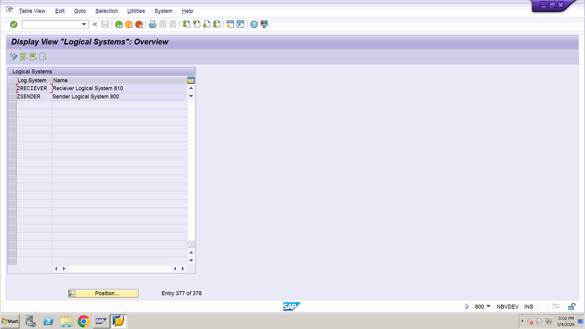
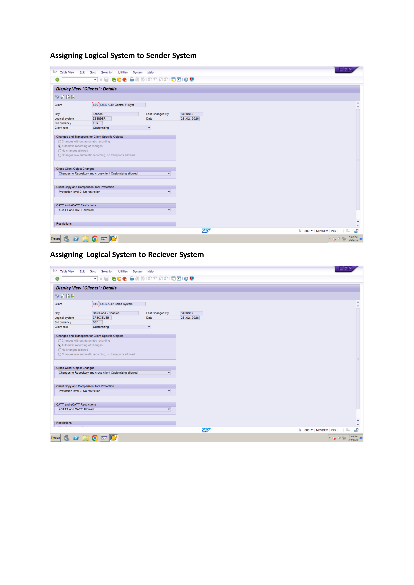
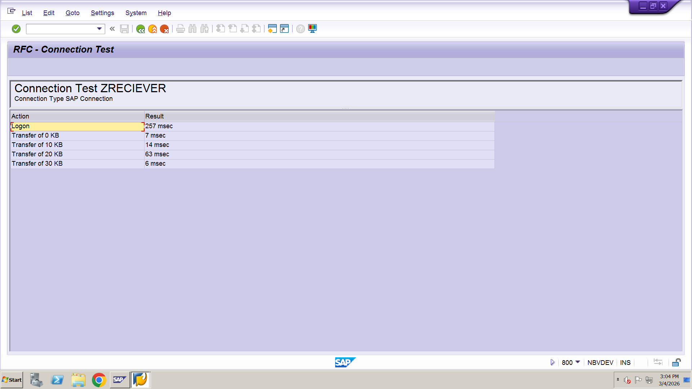
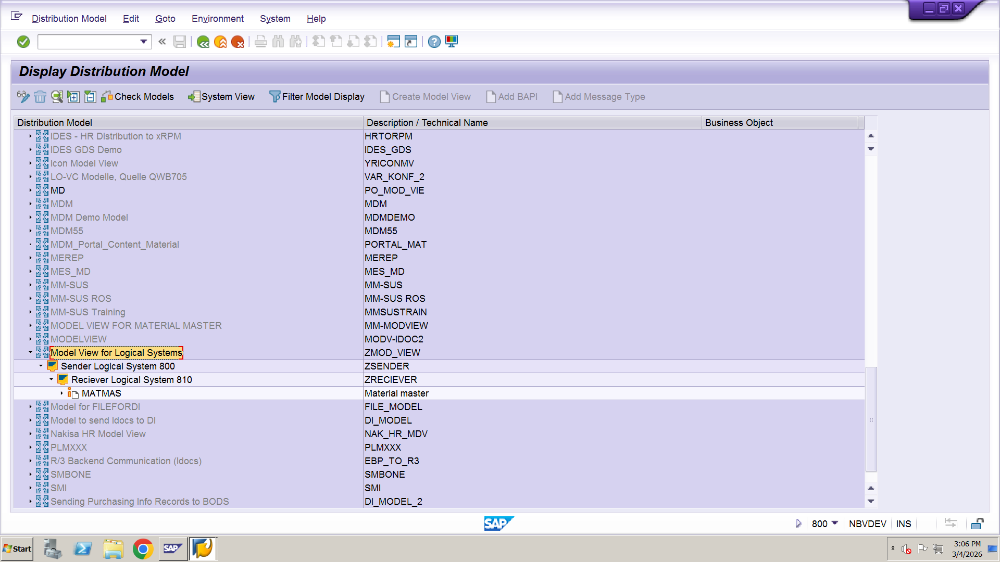
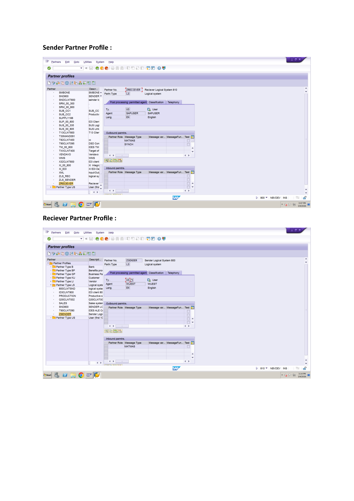
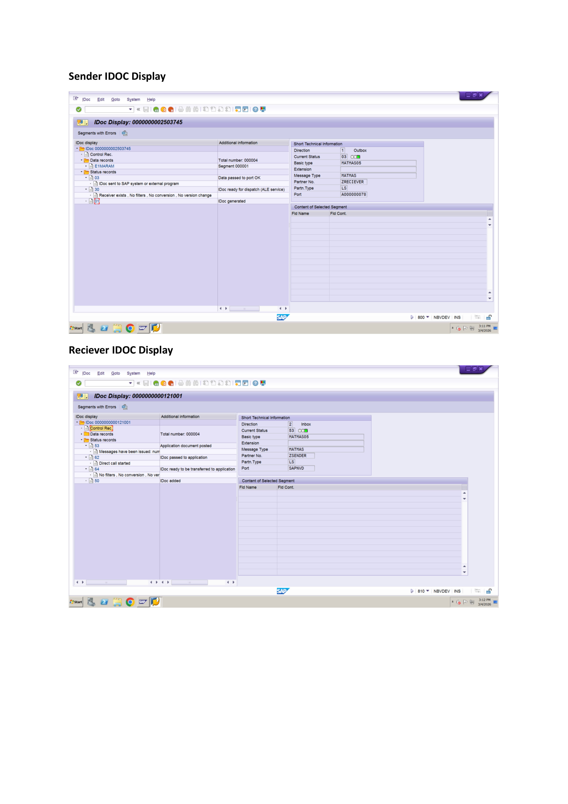

# 📦 SAP ABAP IDoc Integration Project  
## Material Master Transfer (MATMAS05)

---

## 📝 Project Overview

This project demonstrates Material Master data transfer between two SAP systems using IDoc (Intermediate Document) technology through ALE configuration.

Material master records created or changed in the Source System are automatically transferred to the Target System using Message Type **MATMAS** and Basic Type **MATMAS05**.

---

## 🎯 Business Requirement

The business requires automatic synchronization of Material Master data between systems to:

- Ensure data consistency
- Avoid manual duplication
- Reduce errors
- Enable real-time integration

---

## 🔧 Technical Details

| Component        | Value        |
|-----------------|-------------|
| Message Type    | MATMAS      |
| Basic Type      | MATMAS05    |
| Process Code    | MATM        |
| IDoc Direction  | Outbound & Inbound |
| IDoc Tool       | ALE         |

---

## ⚙️ Configuration Steps

### 1️⃣ Logical System Creation
Transaction Code: `BD54`




### 2️⃣ Assign Logical System to Client
Transaction Code: `SCC4`


---

### 3️⃣ RFC Destination Configuration
Transaction Code: `SM59`


---

### 4️⃣ Distribution Model Configuration
Transaction Code: `BD64`



### 5️⃣ Partner Profile Configuration
Transaction Code: `WE20`


## 📂 IDoc Monitoring

Transaction Code: `WE02`

Check IDoc status:

| Status Code | Description |
|-------------|------------|
| 01          | IDoc Created |
| 03          | Data Passed to Port OK |
| 12          | Dispatch OK |
| 53          | Successfully Posted |
| 51          | Error in Application |



## 🧪 Testing Procedure

1. Create or Change material using `MM01` or `MM02`
2. IDoc gets triggered automatically
3. Monitor IDoc in `WE02`
4. Verify material in target system using `MM03`

📷 Screenshot to attach:
- MM01 material creation
- WE02 successful IDoc
- MM03 material display in target system

---

## 📁 GitHub Folder Structure

```
ZMATMAS_IDOC_INTEGRATION/
│
├── README.md
├── Functional_Specification.docx
├── Technical_Specification.docx
├── Screenshots/
│   ├── BD54.png
│   ├── SM59_Test.png
│   ├── BD64_Model.png
│   ├── WE20_PartnerProfile.png
│   ├── WE02_Status53.png
│   └── MM01_MM03.png
│
└── Enhancements/
    └── UserExit_Code.abap
```

---

## 🔍 IDoc Structure Example

Common Segments Used:

- E1MARAM (General Material Data)
- E1MAKTM (Material Description)
- E1MARCM (Plant Data)

---

## 🏁 Project Outcome

✔ Material data successfully transferred  
✔ IDoc generated and processed without errors  
✔ Automatic creation in target system  
✔ Real-time synchronization achieved  

---

## 🛠 Tools & Technologies Used

- SAP ECC / SAP S4HANA
- ALE Configuration
- IDoc Technology
- RFC Communication
- ABAP Enhancements (if applicable)

---

## 👨‍💻 Author

SAP ABAP IDoc Integration Project  
(Material Master Transfer – MATMAS05)

