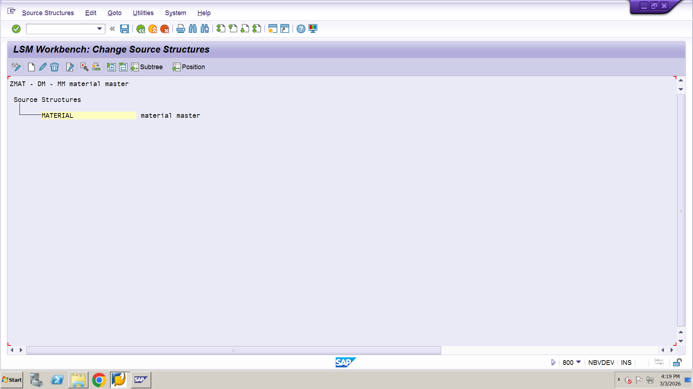
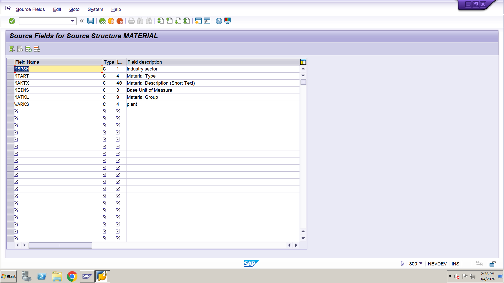
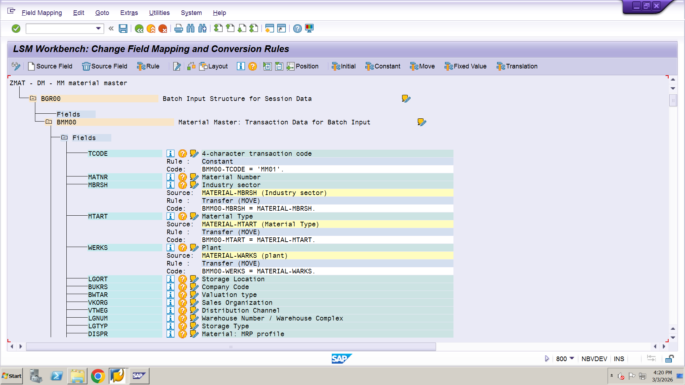
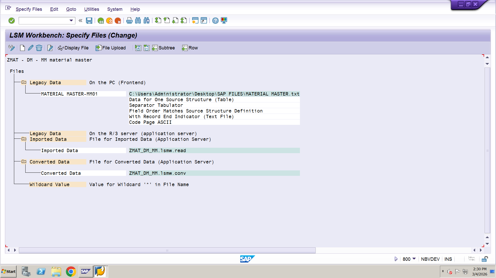
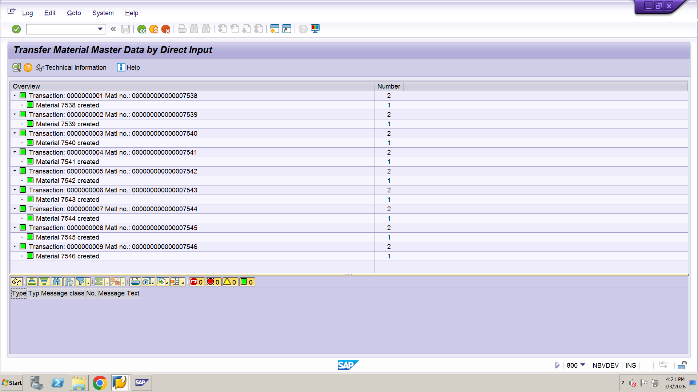

# SAP LSMW – Material Master Upload (Direct Input Method)

## 📌 Project Overview
This project demonstrates uploading Material Master data in SAP using LSMW (Legacy System Migration Workbench) with the Direct Input Method.

The objective of this project is to mass upload material master records efficiently using standard SAP programs.

---

## 🛠 Tools & Technologies
- SAP ECC
- LSMW (Transaction Code: LSMW)
- Direct Input Method
- Object: 0001 – Material Master
- Program: RMDATIND
- Input File: Excel (.xls converted to .txt)

## 📋 Business Requirement
Client required mass upload of Material Master data including:
- Material Type
- Industry Sector
- Base Unit of Measure
- Material Description
- Material Group
- Plant
Manual creation using Transaction Code MM01 was time-consuming.

## ⚙️ LSMW Configuration Steps
### 1️⃣ Create Project
- Transaction Code: LSMW
- Project: ZMAT
- Subproject: DM
- Object: MM

## 1️⃣ Project Creation Screen

### 2️⃣ Maintained Object Attributes
- Object: 0001 – Material Master
- Method: Direct Input
- Program: RMDATIND

### 3️⃣ Maintained Source Structures
Defined source structure as:
BASIC

### 4️⃣ Maintain Source Fields
Example Fields:
 

### 5️⃣ Maintained Field Mapping & Conversion Rules
Mapped source fields to SAP fields using direct mapping or fixed values.

 

### 6️⃣ Specify Files
Uploaded input file (converted .txt file)

### 7️⃣ Start Direct Input Program

- Converted Data

## ✅ Result
Material master records successfully created using Direct Input Method without manual MM01 entry.

## 📌 Advantages
- Faster mass upload
- Reduced manual effort
- Standard SAP Program (No Custom Coding)
- Suitable for Data Migration Projects

---

## 👨‍💻 Author
S MAHAMMAD ASIF     
SAP ABAP Consultant
